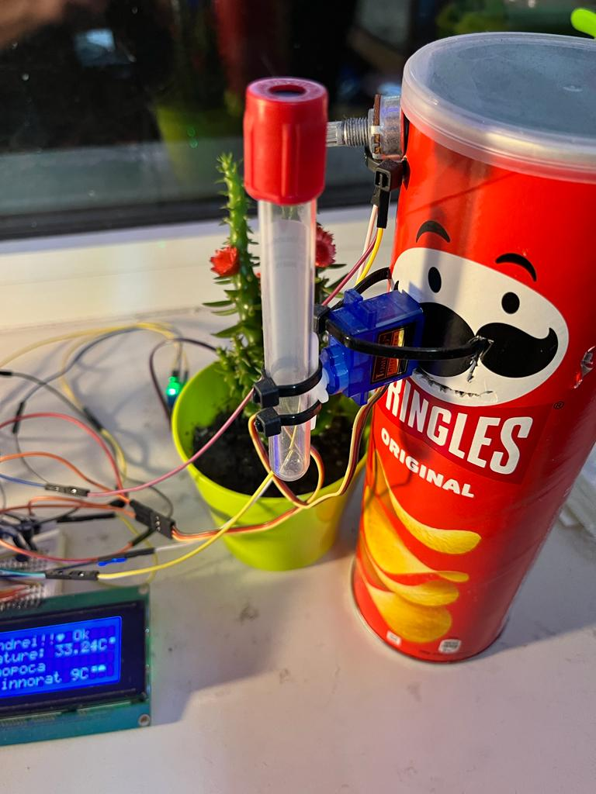

# AutoWatering-Weather-system

A project made for school which displays weather from the internet and auto waters a plant

## Components

<ul>
    <li>Raspberry Pi 3B+</li>
    <li>Arduino Uno board</li>
    <li>20x4 LCD display</li>
    <li>Tower Pro Micro Servo 9g</li>
    <li>Capacitive humidity sensor</li>
    <li>Arduino Uno board</li>
    <li>TMP35 temperature sensors</li>
    <li>Resistors and capacitors</li>
    <li>0 -> 10k Ohm potentiometers</li>
</ul>

## Usage

After the Raspberry PI is powered on it also powers the Arduino which is connected through USB.


### Raspberry Pi

The [**weather script**](RaspberryGetWeather.py) is executed on the RPI by a cronjob every two minutes.
<br>
When it is executed it performs a basic web scrap using the [**BeautifulSoup4**](https://pypi.org/project/beautifulsoup4/) library to get the weather information for a city, in this case Cluj-Napoca, then it sends through serial communication all the weather information to the the Arduino.

### Arduino

The Arduino board performs more tasks.

<ul>
    <li>It is responsible to output the current temperature from the sensor and the weather information on the screen</li>
    <li>It reads the data from the soil humidity sensor and from the temperature sensor</li>
    <li>Controls the servo motor which waters the plant</li>
</ul>

<br>


#### ADC

The two sensors have analog output and I have to convert it to a digital signal, to a numerical value to work with.
<br>
Not to display completly erronate temperatures and not to water the plant if not needed I introduced a filter.
<br>
I compute the average of last 110 measurements every measurment. The oldest measurement is deleted and a new one is inserted on a FIFO principles.
<br>
This also prevents the displayed value from changing to often since it it a cheap sensor it might have large fluctuations.
<br>
This is the temperature filter and there is a similar one for humidity.
<br>
The humidity level is displayed as a status in the top right corner: **Dry**, **Ok** or **Wet**
<br>


```
float calculateNewTemperature(float x)
{
      if(sizeOfTemperatures == sizeOfFilter)
      {
        for(int i = 0; i < (sizeOfTemperatures - 1); i++)
        {
          temperatures[i] = temperatures[i+1];
        }
        sizeOfTemperatures--;
      }
    temperatures[sizeOfTemperatures++] = x;
    float sum = 0;
    for(int i = 0; i < sizeOfTemperatures; i++)
    {
      sum+=temperatures[i];
    }
    return sum/(sizeOfTemperatures);
}
```

#### Plant watering

Since I had no water pump and no solenoid valve I had to improvise. I used a servo motor with a tube to water the plant.
<br>
The servo motor inclines the tube and the water flows to the plant.
<br>
We also did not have a button to tell the Arduino that I have refilled, so I used a potentiometer as a button. If the potentiometer value is less than a value I have filled the tank. _Must not forget to turn the knob back._

<br>



